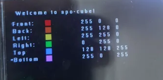

# User Documentation

`apo-cube` is a program to be run on MZ_APO which allows rendering a 3D cube on
its LCD with user-defined face colors. In this document, we describe how to run
the program and how to use it.

## Running `apo-cube`

- Install the necessary dependencies: `gcc-7-arm-linux-gnueabihf` (this can be
  done using Nix with `nix develop`)
- Connect your MZ_APO to the network and find out its IP address
- Clone the repository: `git clone https://github.com/SimonBrandner/apo-cube`
- Enter the cloned repository: `cd apo-cube`
- Create an `.envrc` file: `cp .envrc.sample .envrc`
- In the `.envrc` file set the `TARGET_IP` to the IP address of your MZ_APO
- Run the program: `make run` (for MZ_APO) or `make runv` (for virtual
  peripherals - see next section)

## Peripherals Mode

The program can be run in two modes:

- real hardware mode on MZ_APO
- virtual peripherals mode using [a python
  script](../scripts/virtual_peripherals/virtual_peripherals.py).

Both modes are similar in functionality, but the virtual mode allows for
running our program without the need for MZ_APO hardware. To use the virtual
mode, check its [documentation](scripts/virtual_peripherals/README.md).

## Using `apo-cube`

Once `apo-cube` is running, you are going to be greeted by the main menu in
which you can set the color of the cube's faces, start the 3D view or exit the
program. The following controls can be used in the menu:

- red knob click - select the next option in the menu,
- green knob click - click the selected option,
- blue knob click - select the previous option in the menu and
- knob rotation - when a face is selected, turning a knob will change the
  corresponding part of the face's RGB value.

(The image shows the menu in a state where the bottom face is selected.)

Once you enter the game, the following controls can be used to move the camera
around the cube:

- red knob click - exit to the menu,
- red knob rotation - change the distance of the camera from the cube,
- green knob rotation - change the camera's pitch and
- blue knob rotation - change the camera's yaw.

The user may notice that the closer the camera is to the cube, the more of the
LED line lights up to indicate this.

The minimum distance from the cube is determined by the cube having to stay
fully visible all the time.
